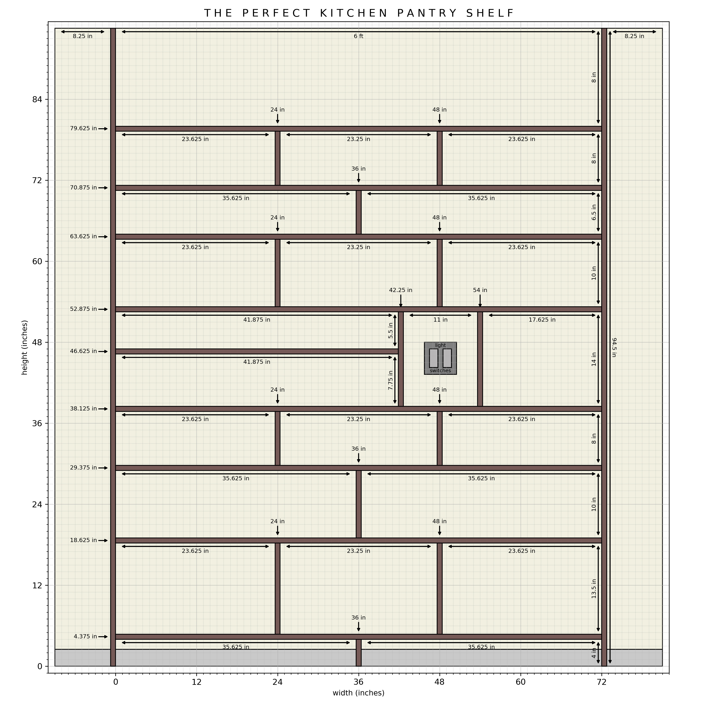

# Pantry Shelf Planning 

Wood: 
- 1 in. x 6 in. x 6 ft. Square Edge Whitewood Common Board (x8 for main horizontal shelves)
- 1 in. x 6 in. x 8 ft. Square Edge Whitewood Common Board (x4 for sides, spice shelf and support dividers)

 

 
